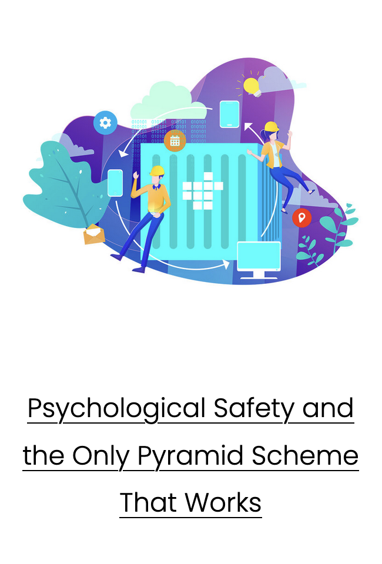

Permanently-Remote Service Reliability Engineer with a focus on the human side of engineering. 

## Connect with me:
[Website][website] | 
[Twitter][twitter] |
[LinkedIn][linkedin]
 

[website]: https://iamevan.me
[twitter]: https://twitter.com/thejokersthief
[linkedin]: https://www.linkedin.com/in/thejokersthief/
## Latest Blog Posts:
<!-- BLOG-POST-LIST:START -->
- [CI/CD Best Practises](https://iamevan.me/blog/cicd-best-practises)
- [2022 Check-in: Professional Development](https://iamevan.me/blog/2022-check-in)
- [The Importance Of A Golden Path](https://iamevan.me/blog/the-importance-of-a-golden-path)
- [2021 Check-in: Professional Development](https://iamevan.me/blog/2021-check-in)
- [The Incident Response Lifecycle](https://iamevan.me/blog/the-incident-response-lifecycle)
<!-- BLOG-POST-LIST:END -->

## Featured Blog Posts:
[][post1]
[][post2]
[][post3]
[][post4]

[post1]: https://iamevan.me/blog/psychological-safety-and-the-only-pyramid-scheme-that-works
[post2]: https://iamevan.me/blog/cicd-best-practises
[post3]: https://iamevan.me/blog/the-importance-of-a-golden-path
[post4]: https://iamevan.me/blog/improving-reliability-by-splitting-up-api-breaking-changes
