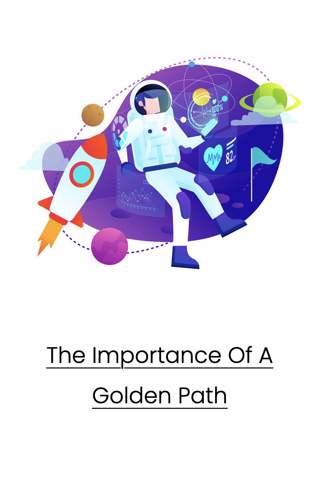

Permanently-Remote Service Reliability Engineer with a focus on the human side of engineering. 

## Connect with me:
[Website][website] | 
[Twitter][twitter] |
[LinkedIn][linkedin]
 

[website]: https://iamevan.me
[twitter]: https://twitter.com/thejokersthief
[linkedin]: https://www.linkedin.com/in/thejokersthief/

## Featured Blog Posts:
[][post1]
[][post2]
[][post3]
[][post4]
 
 
 

[post1]: https://iamevan.me
[post2]: https://iamevan.me
[post3]: https://iamevan.me
[post4]: https://iamevan.me
## Latest Blog Posts:
<!-- BLOG-POST-LIST:START -->
- [Inbox Zero How I Handle Email](https://iamevan.me/categories/sre/2021-02-06-inbox-zero-how-i-handle-email/)
- [2021 Check-in: Professional Development](https://iamevan.me/categories/sre/2021-01-11-2021-check-in-professional-development/)
- [Psychological Safety and the Only Pyramid Scheme That Works](https://iamevan.me/categories/sre/psychological-safety-and-the-only-pyramid-scheme-that-works/)
- [Snippet: Benefits of Leastconn Loadbalancing](https://iamevan.me/categories/sre/2020-10-03-snippet-benefits-of-leastconn-loadbalancing/)
- [Customer Communication During Incidents The How to of Status Page Updates](https://iamevan.me/categories/sre/customer-communication-during-incidents-the-how-to-of-status-page-updates/)
<!-- BLOG-POST-LIST:END -->
